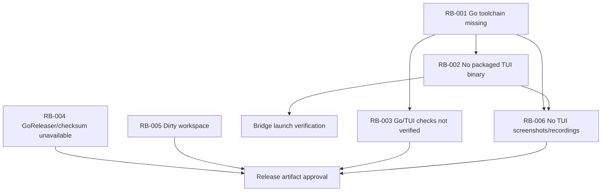

# PRE-RA-FP000 Release Readiness Blocker Triage

Date: 2026-06-01

Refreshed: 2026-06-01

Mode: planning only. No product code was changed by this task.

## 1. Executive Summary

Release readiness remains FAIL for final binary publication. The remaining issues are not evidence that the Node/TypeScript daemon/control plane failed; they are blocked verification and packaging issues around the separate Go Bubble Tea TUI binary, release tooling, and workspace hygiene.

The latest verifier symptom for the first P0 was `npm run tui:build` failing with `spawnSync go ENOENT`. In the current workspace, the TUI npm scripts now route through `scripts/tui-go.mjs` and produce clear missing-tool diagnostics, but this host still has no `go` or `goreleaser` on `PATH`, no `tui/go.sum`, and no built `bin/relaybase-tui/relaybase-tui-windows-amd64.exe`.

The correct release-readiness path is to keep the daemon/control-plane behavior protected, run the remaining Go/TUI checks in a Go-capable environment, produce or package a real TUI binary, verify the Node bridge against that binary, run release archive/checksum dry-runs, then capture manual TUI evidence.

Decision: `BLOCK_AI_AGENT_PROMPTS`. Do not proceed to OpenRouter, OpenAI Agents SDK TS, Relaybase Operator Agent, or future AI-agent roadmap prompts. Proceed only with release-readiness fix prompts.

## 2. What Passed And Should Not Be Disturbed

These areas are protected because the verifier context and existing release-candidate reports mark them as passed or source-hardened:

| Area | Evidence | Protection rule |
| --- | --- | --- |
| Node/TypeScript daemon and API | Verifier context says daemon, API, lifecycle operations, durable logs, grouping, auth failure, exports, and redaction checks passed. `reports/release-candidate/release-readiness.md` says no known product P0/P1 remains in locally executable daemon/API/log/export/Node bridge checks. | Do not refactor daemon lifecycle, app state, auth, log, export, event, or route behavior while fixing TUI packaging/tooling blockers. |
| Lifecycle operations | Verifier context says start/stop/restart operation flow passed. Release readiness says lifecycle start, stop, restart, timeout, and conflict tests pass in Node daemon tests. | TUI must remain a client. Do not move lifecycle logic into Go. |
| Durable logs and export/redaction | Verifier context says durable logs, exports, and redaction checks passed. Hardening report documents unavailable log store diagnostics and export validation coverage. | Do not change log storage/export semantics unless a future verification exposes a concrete P0/P1. |
| Node bridge diagnostics | `src/tuiBridge.ts` implements daemon-unavailable and missing-binary diagnostics. `tests/unit.test.ts` references `runRelaybaseTui` bridge coverage. `node --experimental-strip-types src/cli.ts tui --help` prints bridge usage and binary resolution order. | Keep the bridge command path and diagnostics; the current blocker is missing binary/artifact, not missing command parsing. |
| Packaging dry-run source contents | R015 release readiness and hardening reports record `npm.cmd run package:check` as passed. Current package scripts still expose `package:check`. | Package-content fixes should be scoped to TUI binary/release artifacts, not daemon source reshaping. |

## 3. Blocker Table

| ID | Severity | Symptom | Reproduction command | Classification | Likely root cause | Proposed owner task |
| --- | --- | --- | --- | --- | --- | --- |
| RB-001 | P0 | `relaybase-tui` cannot be built or tested on this host. Latest verifier saw `npm run tui:build` fail with `spawnSync go ENOENT`; current `doctor:tui` reports Go 1.24 required but missing. | `npm.cmd run doctor:tui`; `npm.cmd run tui:build`; `where.exe go` | Environment plus repo tooling | Windows verification host has no `go` on `PATH`. Current repo has `tui/go.mod` with `go 1.24`, but `tui/go.sum` is missing until `go mod tidy` or a Go build/test runs on a Go-capable host. | `PRE-RA-FIX001C - Go-capable TUI module lock and verification run` |
| RB-002 | P0 | `relaybase tui` cannot launch the package binary path because no packaged binary exists. `bin/relaybase-tui/` contains only `README.md`. | `npm.cmd run doctor:tui`; `Get-ChildItem bin\relaybase-tui -Force`; after daemon is running, `npm.cmd run relaybase -- tui` | Packaging plus environment | Build is blocked by RB-001, so no current-platform binary exists. Bridge supports `RELAYBASE_TUI_BIN`, package asset, and platform package resolution, but final package asset/platform package lane has not been proven with a real binary. | `PRE-RA-FIX002 - Package and launch real relaybase-tui binary` |
| RB-003 | P1 | Go test, vet, race, TUI preference, slash command, assistant/command-bar confirmation, and render snapshot checks are not independently verified. | `npm.cmd run tui:test`; `npm.cmd run tui:vet`; `npm.cmd run tui:race` | Test coverage plus environment | Go tests exist in `tui/internal/...`, including preferences, slash, assistant, context menu, model confirmation, pane manager, styles, and golden-like render tests, but this host cannot execute them without Go. There is no npm script named `tui:snapshot` or `tui:smoke`. | `PRE-RA-FIX003 - TUI verification script and evidence lane` |
| RB-004 | P2 | GoReleaser/checksum release dry-run is unavailable. | `where.exe goreleaser`; `npm.cmd run release:check`; `npm.cmd run release:dry-run` | Release tooling plus environment | `.goreleaser.yml` exists and `scripts/tui-go.mjs` exposes release-check/dry-run commands, but `goreleaser` is not installed/on `PATH` on this host. | `PRE-RA-FIX004 - Release archive and checksum dry-run validation` |
| RB-005 | P2 | Workspace remains dirty from existing release work and planning/tooling changes. | `git status --short` | Workspace hygiene | Active monolithic workspace contains modified source/docs/tests plus many untracked release artifacts and reports. Git also warns it cannot access `C:\Users\wamin\.config\git\ignore`. | `PRE-RA-FIX005 - Worktree hygiene and publication-lane classification` |
| RB-006 | P2 | No screenshots or terminal recordings were captured because the TUI binary could not be launched. | No safe binary-launch command exists until RB-001/RB-002 are closed. Search did not find a dedicated terminal recording script. | Evidence coverage plus environment | Built TUI binary is missing, and there is no proven PTY/terminal recording or smoke evidence lane. Existing render tests are source tests only and cannot replace manual/recorded launch evidence. | `PRE-RA-FIX006 - TUI smoke capture evidence` |

## 4. Discovery Findings

Package scripts located in `package.json`:

- Present: `tui:build`, `tui:build:all`, `tui:test`, `tui:vet`, `tui:race`, `doctor:tui`, `release:check`, `release:dry-run`, `package:check`.
- Missing: `tui:snapshot`, `tui:smoke`.

Go/TUI source and output paths:

- Go module: `tui/go.mod`.
- Missing lock file: `tui/go.sum`.
- TUI entrypoint: `tui/cmd/relaybase-tui/main.go`.
- TUI packages/tests: `tui/internal/config`, `tui/internal/events`, `tui/internal/preferences`, `tui/internal/relaybaseclient`, `tui/internal/tui/...`.
- Intended output directory: `bin/relaybase-tui/`.
- Current package binary directory content: only `bin/relaybase-tui/README.md`.
- Current platform expected binary on this host: `bin/relaybase-tui/relaybase-tui-windows-amd64.exe`.

Bridge and release tooling:

- CLI bridge implementation: `src/tuiBridge.ts`.
- CLI command wiring: `src/cli.ts` imports `runRelaybaseTui` and documents `relaybase tui`.
- Build/release wrapper: `scripts/tui-go.mjs`.
- Release config: `.goreleaser.yml`, defining Windows, macOS, and Linux `amd64`/`arm64` archives and `relaybase-tui-checksums.txt`.
- CI config: `.github/workflows/ci.yml` has Node verification, Go TUI test/vet/race jobs, TUI build smoke, and package check.

TUI tests and evidence scripts:

- Existing Go tests cover preferences, assistant provider/privacy shell, deterministic assistant parsing, slash parser/confirmation rules, context menu navigation, model confirmation gates, pane preferences, and render snapshots.
- Golden-like render tests are in `tui/internal/tui/views/views_test.go` with `TestGoldenOnePane`, `TestGoldenTwoPanes`, `TestGoldenFourPanes`, and `TestGoldenEightPanes`.
- No dedicated npm `tui:snapshot` or `tui:smoke` script is present.
- No terminal recording/PTCloud/PTY smoke script was located in `scripts/` or `tui/`.

Prior reports located:

- `reports/release-candidate/release-readiness.md`.
- `reports/release-candidate/hardening-report.md`.
- `reports/release-candidate/known-issues.md`.
- `reports/release-candidate/test-matrix.md`.
- `reports/fix-planning/PRE-RA-FP001-go-toolchain-readiness-plan.md`.
- No separate final verifier report file was found by repository search for `FINAL-VERIFY`, `Independent release readiness`, or `FAIL release readiness`; this triage uses the verifier result supplied in the task context plus the existing R015 reports.

## 5. Dependency Graph Between Blockers

Interpretation:

- RB-001 is the first hard gate. Without Go, Relaybase cannot build/test/vet/race the TUI or generate `tui/go.sum`.
- RB-002 depends on RB-001 because the package binary cannot exist until the TUI is built.
- RB-006 depends on RB-001 and RB-002 because screenshots/recordings require a launchable TUI binary.
- RB-004 is independent of Go installation for source tests but mandatory before release archive/checksum approval.
- RB-005 does not block local proof by itself, but it blocks clean commit/release publication.

## 6. Recommended Fix Order

1. Close RB-001 on a Go-capable host: generate `tui/go.sum`, run `npm.cmd run doctor:tui`, `npm.cmd run tui:test`, `npm.cmd run tui:vet`, and `npm.cmd run tui:race` where stable.
2. Close RB-002: build the current-platform TUI binary, verify `relaybase tui` resolves package asset and `RELAYBASE_TUI_BIN`, and confirm missing-binary diagnostics still fail closed.
3. Close RB-003: add or prove discoverable `tui:snapshot`/`tui:smoke` commands if required by release verification, and run the Go preference/slash/assistant/model/render checks.
4. Close RB-004: run `npm.cmd run release:check` and `npm.cmd run release:dry-run` in an environment with GoReleaser, then record archive/checksum artifact paths.
5. Close RB-006: launch TUI against a test daemon/sample frontend-backend group and capture screenshot or terminal recording evidence.
6. Close RB-005 last: classify source/docs/scripts/tests versus generated artifacts, remove or ignore generated noise only with explicit approval, and stage/publish only the intended release-readiness subset.
7. Re-run FINAL-VERIFY from a clean or disposable workspace with Go and GoReleaser available.

## 7. Required Implementation Prompts

### PRE-RA-FIX001C - Go-capable TUI module lock and verification run

Likely files to change:

- `tui/go.sum`.
- Possibly `docs/tui-toolchain.md` only if Go-capable evidence changes the documented setup.
- Possibly `.github/workflows/ci.yml` only if CI fails because `go.sum` or setup-go cache behavior needs adjustment.

Commands to run:

- `go version`.
- `go env GOVERSION GOOS GOARCH GOMOD GOMODCACHE` from `tui/`.
- `go mod tidy` from `tui/`.
- `npm.cmd run doctor:tui`.
- `npm.cmd run tui:test`.
- `npm.cmd run tui:vet`.
- `npm.cmd run tui:race` where stable.
- `git status --short`.

Acceptance criteria:

- `tui/go.sum` exists and is reviewable.
- Missing Go is no longer ambiguous on non-Go hosts.
- Go tests/vet/race are either passing or failures are documented with exact reproduction.
- No daemon/control-plane behavior is changed.

### PRE-RA-FIX002 - Package and launch real relaybase-tui binary

Likely files to change:

- `bin/relaybase-tui/<platform binary>` for local verification only, or release packaging configuration if binary artifacts are produced outside the source tree.
- `package.json` `files` list only if package inclusion is wrong.
- `src/tuiBridge.ts` and `tests/unit.test.ts` only if real binary resolution reveals a bridge bug.
- `docs/cli.md` and `docs/tui-toolchain.md` only if launch documentation is inaccurate.

Commands to run:

- `npm.cmd run tui:build`.
- `Get-ChildItem bin\relaybase-tui -Force`.
- `npm.cmd run package:check`.
- `node --experimental-strip-types src/cli.ts tui --help`.
- `node --experimental-strip-types src/cli.ts tui` with daemon unavailable to verify diagnostic.
- With test daemon running: `npm.cmd run relaybase -- tui -- --help` or equivalent safe launch check.

Acceptance criteria:

- Current-platform binary exists or release package lane clearly supplies it.
- `relaybase tui` launches the binary when daemon is reachable.
- Missing-binary diagnostic remains clear and actionable.
- Bridge forwards exit code and does not spawn through a shell.

### PRE-RA-FIX003 - TUI verification script and evidence lane

Likely files to change:

- `package.json` if adding `tui:snapshot` or `tui:smoke`.
- `scripts/` if adding a smoke or snapshot wrapper.
- `tui/internal/...` tests only to fix real test failures.
- `reports/release-candidate/test-matrix.md` only after verified evidence exists.

Commands to run:

- `npm.cmd run tui:test`.
- `npm.cmd run tui:vet`.
- `npm.cmd run tui:race` where stable.
- `npm.cmd run tui:snapshot` if added.
- `npm.cmd run tui:smoke` if added.
- `git status --short`.

Acceptance criteria:

- Preference, slash, assistant, command-bar confirmation, context menu, pane, and render checks are independently executed.
- Snapshot/render evidence has a discoverable command or exact Go test names.
- No fake screenshots or fake success records are created.

### PRE-RA-FIX004 - Release archive and checksum dry-run validation

Likely files to change:

- `.goreleaser.yml` only if GoReleaser validation fails.
- `package.json` and `scripts/tui-go.mjs` only if release wrapper behavior is wrong.
- `.github/workflows/ci.yml` only if CI needs a GoReleaser setup step.
- `reports/release-candidate/release-readiness.md` only after verified dry-run evidence exists.

Commands to run:

- `goreleaser --version`.
- `npm.cmd run release:check`.
- `npm.cmd run release:dry-run`.
- Inspect `dist/` archives and checksum file if generated.
- `git status --short`.

Acceptance criteria:

- GoReleaser config validates.
- Snapshot release produces expected platform archives and `relaybase-tui-checksums.txt`.
- Generated release artifacts are not accidentally staged unless explicitly approved.

### PRE-RA-FIX005 - Worktree hygiene and publication-lane classification

Likely files to change:

- None by default; this is classification first.
- `.gitignore` only if generated artifacts need durable exclusion and user approves.
- Staging set only after user explicitly requests commit/publish.

Commands to run:

- `git status --short`.
- `git diff --stat`.
- `git diff --name-only`.
- `git ls-files --others --exclude-standard`.
- Optional targeted `git diff -- <path>` for files being classified.

Acceptance criteria:

- Dirty files are classified into source/docs/scripts/tests, planning reports, generated artifacts, and local-only noise.
- No generated DBs, logs, binaries, or raw diagnostic artifacts are staged without explicit approval.
- Permission warning for `C:\Users\wamin\.config\git\ignore` is either resolved by the user environment or documented as non-product.

### PRE-RA-FIX006 - TUI smoke capture evidence

Likely files to change:

- `scripts/` if adding a terminal/smoke capture harness.
- `reports/release-candidate/test-matrix.md`, `hardening-report.md`, or `release-readiness.md` only after real evidence exists.
- No daemon/product code unless smoke reveals a concrete P0/P1.

Commands to run:

- Start daemon in a disposable state directory.
- Register or load sample frontend/backend app fixtures without starting unknown user apps.
- Launch direct `relaybase-tui` binary.
- Launch `relaybase tui` through the Node bridge.
- Capture screenshot or terminal recording.
- Verify pane grouping, start/stop/restart operation flow, logs, preferences, slash confirmation, assistant confirmation, and clean quit.

Acceptance criteria:

- TUI visibly connects to daemon.
- Daemon-unavailable and auth-failure diagnostics are observed where safely testable.
- Frontend/backend group appears as panes.
- Terminal evidence is captured and referenced by path.
- No unsupported state is described as complete.

## 8. Explicit AI-Agent Prompt Decision

`BLOCK_AI_AGENT_PROMPTS`

AI-agent roadmap prompts may not proceed yet. Release-readiness fix prompts may proceed in the recommended order above. The next prompt to run should be `PRE-RA-FIX001C - Go-capable TUI module lock and verification run` if a Go-capable host is available or the user explicitly approves installing Go. If Go remains unavailable, run no product implementation prompt; keep the blocker open as environment/tooling.

## 9. Commands Run For This Triage

- `Get-Content -Raw AGENTS.md`.
- `Get-Content -Raw docs/relaybase-release-roadmap.md`.
- `Get-Content -Raw docs/tui-architecture.md`.
- `Get-Content -Raw docs/tui-testing-strategy.md`.
- `Get-Content -Raw reports/release-candidate/release-readiness.md`.
- `Get-Content -Raw reports/release-candidate/hardening-report.md`.
- `Get-Content -Raw reports/fix-planning/PRE-RA-FP001-go-toolchain-readiness-plan.md`.
- `codegraph-mcp agent-use status --repo . --json` failed because `codegraph-mcp` is not on `PATH`.
- `C:\Users\wamin\Desktop\development\codegraph-mcp\target\release\codegraph-mcp.exe agent-use status --repo . --json` passed with `claimable: true`, `graph_db_status: ready`, and `graph_freshness: current`; candidate sidecar query index warnings remain non-blocking for graph DB reuse.
- `C:\Users\wamin\Desktop\development\codegraph-mcp\target\release\codegraph-mcp.exe agent-use context-pack --repo . --task "PRE-RA-FP000 release-readiness blocker triage before AI-agent work" --agent-json` passed with `claimable: true`, ready graph DB, and no lifecycle blockers; it returned fallback/text evidence rather than graph proof paths for this planning task.
- `npm.cmd run`.
- `npm.cmd run doctor:tui` failed as expected because Go is missing; it reported missing Go, missing `tui/go.sum`, missing package binary, and missing GoReleaser.
- `where.exe go` reported no match.
- `where.exe goreleaser` reported no match.
- `Test-Path tui\go.sum` returned `False`.
- `Get-Content -Raw tui\go.mod`.
- `Get-Content -Raw package.json`.
- `Get-Content -Raw scripts\tui-go.mjs`.
- `Get-Content -Raw src\tuiBridge.ts`.
- `Get-Content -Raw .goreleaser.yml`.
- `Get-Content -Raw .github\workflows\ci.yml`.
- `Get-ChildItem bin\relaybase-tui -Force`.
- `rg -n 'tui:build|tui:build:all|tui:test|tui:vet|tui:race|tui:snapshot|tui:smoke|doctor:tui|package:check|release:check|release:dry-run|runRelaybaseTui|relaybase tui|goreleaser|checksum|relaybase-tui|snapshot|golden|pty|record|terminal' package.json scripts src tests tui docs reports .github -g '!node_modules/**'`.
- `Get-ChildItem -Recurse tui -File`.
- `Get-ChildItem -Recurse reports -File`.
- `rg -n 'TestGolden|Preference|preferences|Slash|slash|Assistant|assistant|confirmation|Confirm|CtrlO|CtrlZ|Context|context menu|Quit|Help|Theme|Snapshot' tui\internal -g '*_test.go'`.
- `node --experimental-strip-types src\cli.ts tui --help`.
- `rg -n 'FINAL-VERIFY|Independent release readiness|release verifier|FAIL release readiness|do not ship|ship with known issues|PASS release readiness|FAIL' reports docs . -g '*.md' -g '!node_modules/**'`.
- `git status --short`.

## 10. Current Dirty Workspace Summary

`git status --short` reports modified source/docs/tests/workflow files and many untracked release-roadmap, report, script, API, TUI, and binary-directory paths. It also reports:

`warning: unable to access 'C:\Users\wamin/.config/git/ignore': Permission denied`

This is a workspace hygiene issue, not a product-code readiness failure. It must be resolved or explicitly documented before any commit, package publication, or remote push.
